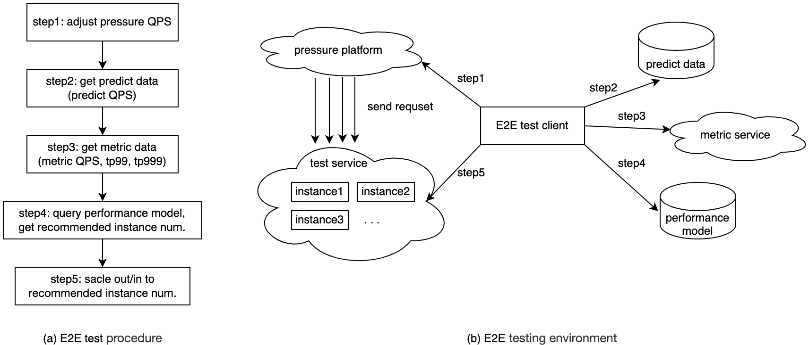

# E2E Test
This is our end-to-end testing framework for testing our intelligent elastic scaling, which is only used for testing in our enterprise environment (and therefore cannot be run in external environments), but we will demonstrate how we conduct end-to-end testing.
## E2E Test Description
How do we conduct end-to-end testing and our testing environment:
